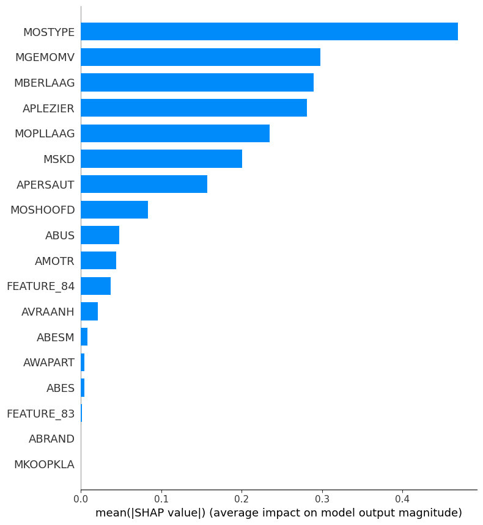
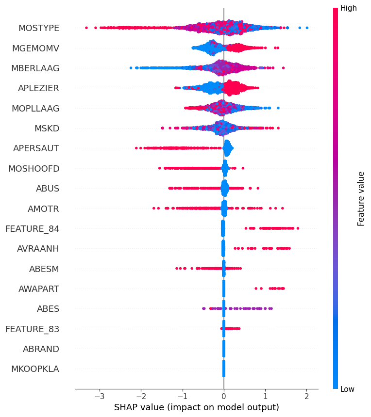

# Snapshot-Data-set-Lapse-and-churn-prediction
Snapshot Data set Lapse and churn prediction
## Project Approach & Highlights

### Objective
- Predict customer lapse and churn in insurance using advanced analytics and ML models.
- Enable business teams to identify at-risk customers and deploy targeted retention strategies.

### Solution Steps

1. **Data Acquisition & Understanding**
   - Used [COIL 2000 dataset](https://archive.ics.uci.edu/dataset/125/insurance+company+benchmark+coil+2000).
   - Explored customer demographics, policy details, claim history, and behavioral features.

2. **Data Preparation**
   - Data cleaning, missing value imputation, and categorical encoding.
   - Feature engineering to create new informative variables.

3. **Exploratory Data Analysis (EDA)**
   - Univariate and bivariate analysis.
   - Visualizations of churn/lapse rates by customer segment.

4. **Modeling**
   - Built ML models (Gradient Boosting, LightGBM, etc.).
   - Developed time series models for trend forecasting.
   - Applied cross-validation and profit-based threshold optimization.

5. **Model Evaluation**
   - Metrics: AUC, F1-score, recall, business KPIs.
   - Explainability via SHAP for feature importance and model insights.

6. **Business Insights & Actionables**
   - Identified top risk factors for lapse/churn.
   - Customer segmentation for personalized retention strategies.
   - Recommendations for targeted marketing campaigns.

7. **Benefits**
   - Early warning for at-risk customers.
   - Improved targeting and retention.
   - Potential for increased revenue and customer satisfaction.

---
## Model Explainability & Results

### Feature Importance (SHAP Summary)

The most important features influencing lapse and churn prediction were identified using SHAP values:

  

  

- **MOSTYPE**, **MGEMOMV**, and **MBERLAAG** are the top predictors according to SHAP.
- The bar plot shows the average impact of each feature on the model’s predictions.
- The summary (dot) plot shows how high/low values of each feature push the prediction toward lapse/churn or retention.

---

### Model Benchmarking

| Model                             | ROC-AUC | Accuracy | Precision (1) | Recall (1) | F1-Score (1) | Remarks                    |
|------------------------------------|---------|----------|---------------|------------|--------------|----------------------------|
| Logistic Regression (balanced)     | 0.6636  | 0.8715   | 0.1550        | 0.2605     | 0.1944       | Baseline, simple           |
| Gradient Boosting (default)        | 0.6808  | 0.8425   | 0.1397        | 0.3193     | 0.1944       | Good recall                |
| Gradient Boosting (tuned)          | 0.6253  | 0.8245   | 0.1246        | 0.3235     | 0.1799       | Better thresholding        |
| Logistic Regression (SMOTE)        | 0.6575  | 0.8373   | 0.1332        | 0.3151     | 0.1873       | Balanced boost             |
| Gradient Boosting (SMOTE)          | 0.6228  | 0.8327   | 0.1145        | 0.2689     | 0.1606       | Lower overall              |
| Random Forest (balanced)           | 0.6144  | 0.7910   | 0.1137        | 0.3697     | 0.1739       | High recall only           |
| XGBoost (scale_pos_weight)         | 0.6106  | 0.8968   | 0.1622        | 0.1765     | 0.1690       | Conservative               |
| LightGBM (tuned)                   | 0.6488  | 0.8935   | 0.1803        | 0.2227     | 0.1992       | Best single model          |
| LightGBM (scale_pos_weight tuned)  | 0.6089  | 0.8940   | 0.1630        | 0.1891     | 0.1751       | Lower F1                   |
| ✅ Stacking (LGBM + GBDT + Logistic)| 0.6481  | 0.8942   | 0.1688        | 0.2815     | 0.2113       | **Best F1 overall** ✅      |

> **Note:** “1” refers to the positive class (churn/lapse).

#### Key Insights

- **Stacked model** (LightGBM + Gradient Boosting + Logistic Regression) achieved the best F1-score and balanced recall/precision.
- SHAP analysis provided transparency, enabling business stakeholders to understand which factors drive churn or retention.

---

